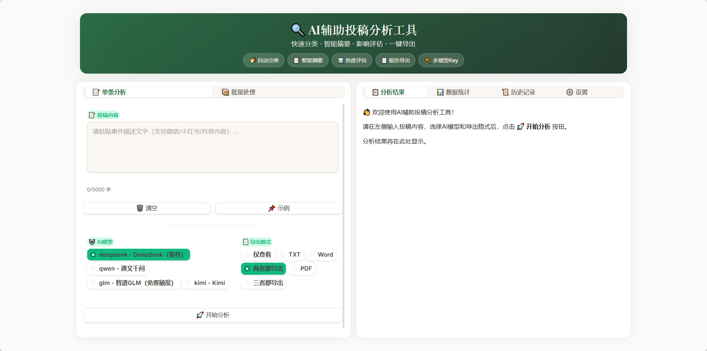
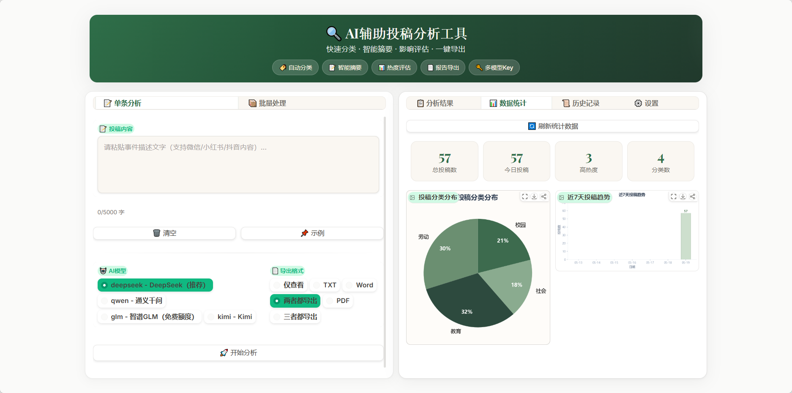
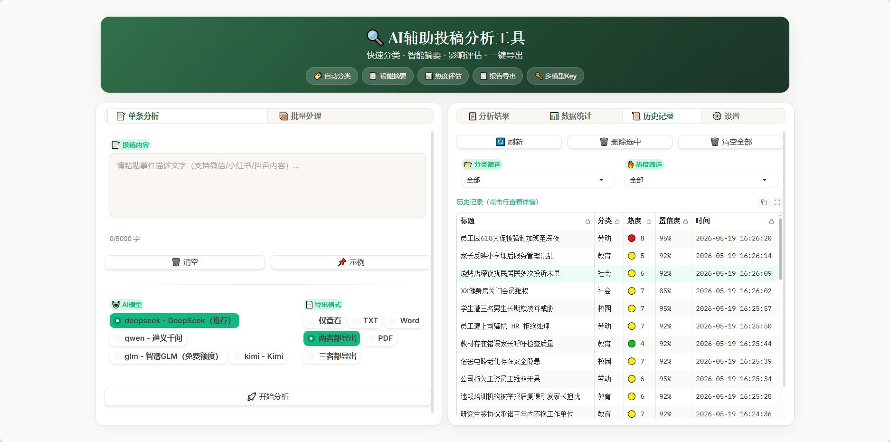
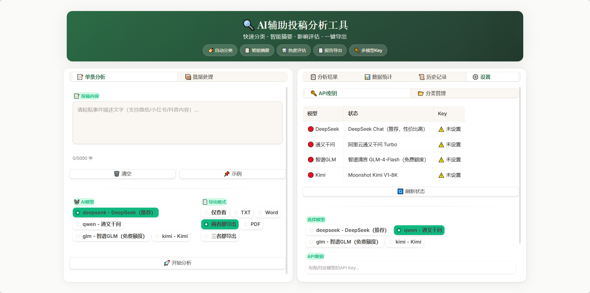

# 🔍 AI辅助投稿分析工具

> 快速分类 · 智能摘要 · 影响评估 · 一键导出

一个基于国产 AI 模型的投稿分析工具，帮助社区志愿者快速处理投稿内容：自动分类、智能摘要、热度评估，显著减少人工看帖时间。

[](https://www.python.org/)
[](https://www.gradio.dev/)
[](LICENSE)

---

## 📸 界面截图

### 首页 - 投稿分析


### 数据分析 - 统计图表


### 历史记录 - 分析存档


### 设置 - API配置


---

## ✨ 功能特性

- 🏷️ **自动分类** — AI 智能识别事件类型（教育、劳动、社会、科技等）
- 📝 **智能摘要** — 提取核心事实，浓缩为 3-5 句关键信息
- 📊 **热度评估** — 多维评估事件影响力（1-10 分热度评分）
- 📄 **多格式导出** — 支持 TXT / Word / PDF 三种报告格式
- 📦 **批量分析** — 上传 CSV/TXT 文件，批量处理多条投稿
- 🔑 **多模型支持** — DeepSeek / 通义千问 / 智谱GLM / Kimi 任选
- 📊 **数据统计** — 分类分布饼图、7 天趋势折线图
- 📜 **历史记录** — 自动保存分析历史，支持分类/热度筛选
- ⚙️ **自定义分类** — 自由添加/删除事件分类类别
- 🎨 **暗色主题** — 现代 UI 设计，护眼舒适

---

## 🚀 快速开始

### 环境要求

- **Python 3.8+**
- **Windows** / macOS / Linux

### 安装与启动

```bash
# 1. 克隆仓库
git clone https://github.com/hahalongha/ai-submission-analyzer.git
cd ai-submission-analyzer

# 2. 安装依赖
pip install -r requirements.txt

# 3. 启动应用
python app.py
```

**Windows 用户**：直接双击 `start.bat` 一键启动。

浏览器自动打开 http://localhost:7860 即可使用。

### 配置 API 密钥

在"⚙️ 设置 → 🔑 API密钥"页面填入任一模型的 API Key：

| 模型 | 推荐度 | 获取地址 |
|------|--------|---------|
| **DeepSeek** | ⭐⭐⭐⭐⭐ | [platform.deepseek.com](https://platform.deepseek.com/api_keys) |
| **通义千问** | ⭐⭐⭐⭐ | [dashscope.console.aliyun.com](https://dashscope.console.aliyun.com/apiKey) |
| **智谱GLM** | ⭐⭐⭐ | [open.bigmodel.cn](https://open.bigmodel.cn/usercenter/apikeys) |
| **Kimi** | ⭐⭐⭐ | [platform.moonshot.cn](https://platform.moonshot.cn/console/api-keys) |

---

## 📖 使用指南

### 单个投稿分析

1. 在左侧文本框粘贴投稿内容（支持从微信、小红书、抖音复制的内容）
2. 选择 AI 模型（推荐 DeepSeek）
3. 选择导出格式（TXT / Word / PDF / 两者都导出 / 三者都导出）
4. 点击 **🚀 开始分析**
5. 右侧显示分析报告，下方可下载导出文件

### 批量投稿分析

1. 切换到"📦 批量处理"标签
2. 上传 CSV 或 TXT 文件（每行一条投稿）
3. 选择 AI 模型和导出格式
4. 点击 **🚀 开始批量分析**
5. 左列显示表格摘要（标题、分类、热度、置信度）
6. **点击表格行** → 右列显示该条投稿的详细分析报告

---

## 📊 分析结果说明

### 事件分类

| 类别 | 说明 |
|------|------|
| 教育 | 学校教育、教学改革、教育公平、考试招生等 |
| 劳动 | 劳动者权益、工资薪酬、加班文化、劳动纠纷等 |
| 校园 | 校园生活、学生活动、校园安全、宿舍食堂等 |
| 社会 | 社会民生、公共政策、社区治理、社会公平等 |
| 科技 | 科技发展、数据隐私、人工智能、互联网平台等 |
| 环境 | 环境污染、生态保护、气候变化等 |
| 医疗 | 医疗资源、医患关系、公共卫生等 |
| 其他 | 不属于以上类别的事件 |

> 💡 可在"⚙️ 设置 → 📂 分类管理"中自定义分类类别。

### 热度评分

| 分数 | 等级 | 含义 |
|------|------|------|
| 8-10 | 🔴 高热度 | 影响范围大、传播性强、需优先关注 |
| 5-7 | 🟡 中热度 | 有一定影响、值得关注 |
| 1-4 | 🟢 低热度 | 影响有限、可常规处理 |

---

## 🏗️ 项目架构

```
ai-submission-analyzer/
├── app.py                    # Gradio Web 界面入口
├── ai_engine.py              # AI 核心引擎（调用模型 API）
├── report_generator.py       # 报告生成与导出（TXT/Word/PDF）
├── config.py                 # 全局配置、模型定义、密钥管理
├── storage.py                # 历史记录、数据统计持久化
├── requirements.txt          # Python 依赖
├── start.bat                 # Windows 一键启动脚本
├── picture/                  # 界面截图
│   ├── 首页.png
│   ├── 数据分析.png
│   ├── 历史记录.png
│   └── 设置.png
├── data/                     # 运行时数据（自动生成）
│   ├── history.json          #   分析历史记录
│   ├── api_keys.json         #   已保存的 API 密钥
│   └── categories.json       #   自定义分类配置
└── output/                   # 导出文件目录
```

---

## 🛠️ 技术栈

| 层级 | 技术 | 用途 |
|------|------|------|
| **Web 界面** | Gradio 6.0+ | 交互式 Web UI |
| **AI SDK** | OpenAI Python SDK | 统一调用各模型 API |
| **AI 模型** | DeepSeek / 通义千问 / 智谱GLM / Kimi | 文本分析 |
| **数据处理** | Pandas | 批量数据表格展示 |
| **可视化** | Matplotlib | 统计图表（饼图/折线图） |
| **文档导出** | python-docx / fpdf2 | Word / PDF 报告生成 |

---

## ❓ 常见问题

**Q: 启动报错"未配置 API 密钥"**
A: 在"⚙️ 设置 → 🔑 API密钥"中选择模型、填入 Key、点击"💾 保存"。

**Q: 分析结果不准确**
A: 可尝试切换不同 AI 模型，不同模型对同一内容的分析可能有差异。

**Q: Word 导出乱码**
A: 请使用 Microsoft Word 或 WPS 打开，不要用记事本打开 `.docx` 文件。

**Q: 批量分析表格不显示**
A: 确保上传的 CSV/TXT 文件编码为 UTF-8，每行一条投稿内容。

---

## 📝 License

MIT License — 详见 [LICENSE](LICENSE) 文件。
